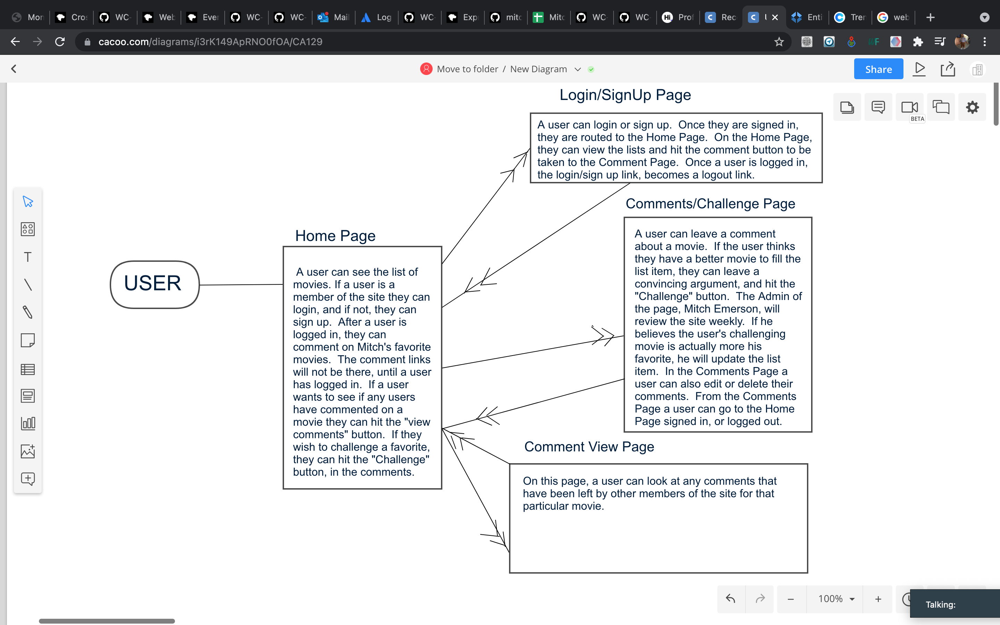

# TOP50LIST

## Description
The MITCH'S TOP 50 LIST, is a website with...you guessed it, Mitch's top 50 favorite movies.  If a user believes they have a better movie 
than one of Mitch's individual movie list items, they can challenge that movie with another movie.

 1) As a user I want to see Mitch's movie list (READ)
 2) Generate comments/posts (CREATE)
 3) Challenge a movie (UPDATE)
 4) Add a film and/or actor (CREATE)
 5) Edit comments/posts (UPDATE)
 6) Delete # KMFFDB Keith and Mitch Fringe Film Database

## Wireframes and User Flow Images (Used in planning)

 

## Description
The MITCH'S TOP 50 LIST, is a website with...you guessed it, Mitch's top 50 favorite movies.  If a user believes they have a better movie 
than one of Mitch's individual movie list items, they can challenge that movie with another movie.

 1) As a user I want to see Mitch's movie list (READ)
 2) As a user I want to be able to leave a comment about a movie (CREATE)
 3) As a user I want to be able to challenge a movie (UPDATE)
 5) As a user I want to be able to edit comments/posts (UPDATE)
 6) As a user I want to be able to delete a comment I made. (DELETE)

## Wireframes and User Flow Images (Used in planning)

 

 

## 2 Models
-Users
-Movielist

## Configuration(Dependencies)

"dotenv": "^8.2.0",
"ejs": "^3.1.6",
"express": "^4.17.1",
"method-override": "^3.0.0",
"mongoose": "^5.12.5"

## Author & Acknowledgements

The author of this code, Mitch Emerson, would like to thank:
Dalton Justis-Hart
April Gonzales
Maiki Moseley
All of the amazing people in WC-322
and General Assembly.

## License

Open Source MIT